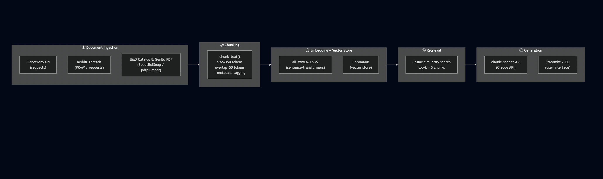

# Project 1 Planning: The Unofficial Guide

> Write this document before you write any pipeline code.
> Your spec and architecture diagram are what you'll use to direct AI tools (Claude, Copilot, etc.) to generate your implementation — the more specific they are, the more useful the generated code will be.
> Update the Retrieval Approach and Chunking Strategy sections if you change your approach during implementation.
> Update this file before starting any stretch features.

---

## Domain

<!-- What domain did you choose? Why is this knowledge valuable and hard to find through official channels? -->

## Course and professor reviews at the University of Maryland, College Park

## Documents

<!-- List your specific sources: URLs, subreddit names, forum threads, or file descriptions.
     Aim for at least 10 sources that together cover different subtopics or perspectives within your domain. -->

| #   | Source                              | Description                                                                                             | URL or location                                                                                |
| --- | ----------------------------------- | ------------------------------------------------------------------------------------------------------- | ---------------------------------------------------------------------------------------------- |
| 1   | PlanetTerp API                      | Planet terp is a website with lots of course and professor reviews for the University of Maryland (UMD) | https://planetterp.com/api/                                                                    |
| 2   | UMD Office of Undergraduate Studies | Official class catalog for 2026-2027                                                                    | https://academiccatalog.umd.edu/undergraduate/approved-courses                                 |
| 3   | UMD Office of Undergraduate Studies | General Education Requirements                                                                          | https://gened.umd.edu/sites/default/files/2024-04/GenEdFolder24-25.pdf                         |
| 4   | University of Maryland              | Schedule of Classes                                                                                     | https://app.testudo.umd.edu/soc/gen-ed/                                                        |
| 5   | Reddit                              | Computer Science Course Recommendations                                                                 | https://www.reddit.com/r/UMD/comments/wi60h9/cmsc_courses_post_graduation_review_and_some/     |
| 6   | Reddit                              | Weed Out Courses at UMD                                                                                 | https://www.reddit.com/r/UMD/comments/1kjoatw/weeded_out                                       |
| 7   | Reddit                              | Course Evaluations at UMD                                                                               | https://www.reddit.com/r/UMD/comments/1h5tidr/im_begging_yall_to_fill_out_course_evals_closing |
| 8   | UMD IO                              | Non-live data about UMD (buildings, facilities, etc.)                                                   | https://github.com/umdio/umdio-data                                                            |
| 9   | UMD IO                              | Live data about UMD (professors, courses, buses, etc.)                                                  | https://beta.umd.io/                                                                           |
| 10  | Reddit                              | Premed Class Recommendations at UMD                                                                     | https://www.reddit.com/r/UMD/comments/1pyfk8z/pre_med_classes_at_umd/                          |

Summary of domain:
The sources are a mix of planet terp's API, official school sources, reddit threads, and UMD IO's data. I think that this knowledge can be hard to find especially if you're a freshman because you don't know where to look yet.

---

## Chunking Strategy

<!-- How will you split documents into chunks?
     State your chunk size (in tokens or characters), overlap size, and explain why those
     numbers fit the structure of your documents.
     A review-heavy corpus warrants different chunking than a long FAQ. -->

**Chunk size:**
300-400 tokens

**Overlap:**
50 tokens

**Reasoning:**
The information I will get from PlanetTerp reviews and Reddit comments are likely to be short. I think that 300-400 tokens should be enough to capture them completely. 50 tokens should be enough to handle overlap.

---

## Retrieval Approach

<!-- Which embedding model are you using (e.g., all-MiniLM-L6-v2 via sentence-transformers)?
     How many chunks will you retrieve per query (top-k)?
     If you were deploying this for real users and cost wasn't a constraint, what tradeoffs
     would you weigh in choosing a different embedding model — context length, multilingual
     support, accuracy on domain-specific text, latency? -->

**Embedding model:**
I will be using all-MiniLM-L6-v2 via sentence-transformers.

**Top-k:**
5-7 chunks

**Production tradeoff reflection:**
The main tradeoffs to weigh in choosing a different embedding model would be domain accuracy with UMD specific information like course codes and latency because higher dimension embeddings are more accurate but take more time than lower dimension embeddings.

---

## Evaluation Plan

<!-- List your 5 test questions with their expected correct answers.
     Questions should be specific enough that you can judge whether the system's response
     is right or wrong. "What are good dining halls?" is too vague.
     "What do students say about wait times at [dining hall name] during lunch?" is testable. -->

| #   | Question                                                                        | Expected answer                                                                                                                                                                                       |
| --- | ------------------------------------------------------------------------------- | ----------------------------------------------------------------------------------------------------------------------------------------------------------------------------------------------------- |
| 1   | Who is the best professor for CMSC131?                                          | Nelson Padua-Perez is the best professor for CMSC131 as he has high reviews on PlanetTerp.                                                                                                            |
| 2   | What is the average grade for students in Algorithms (CMSC351)?                 | According to PlanetTerp, the average grade for students in CMSC351 is between 50-60 Many students consider this course to be a difficult weed out course.                                             |
| 3   | What Distributive Studies Gen Ed categories do UMD undergrads have to complete? | UMD undergrads must complete five categories of Gen Eds: DSSP, DSHU, DSNS, DSNL, and DSBS. This is according to UMD's Gen Ed Guide.                                                                   |
| 4   | What computer science professors should I avoid taking?                         | According to PlanetTerp, Professor Larry Herman has negative reviews for many of the classes he teaches.                                                                                              |
| 5   | What is the distributive studies gen ed requirement?                            | Distributive studies is a gen ed requirement that teches students about a variety of disciplines, the methods they use, the kinds of questions they ask, and their standards for judging the answers. |

---

## Anticipated Challenges

<!-- What could go wrong? Name at least two specific risks with reasoning.
     Consider: noisy or inconsistent documents, missing source attribution, off-topic
     retrieval, chunks that split key information across boundaries. -->

1. I think there could be some challenges with missing source attribution, because it can be hard sometimes to determine where an answer came from. This is especially true if the answer was informed by several sources.

2. Another challenge I expect with reasoning is that old data might inform reasoning when it is really not relevant any more. Some of the sources I plan to use have data about UMD that spans back many years, and oftentimes that data will not be very helpful.

---

## Architecture

<!-- Draw a diagram of your pipeline showing the five stages:
     Document Ingestion → Chunking → Embedding + Vector Store → Retrieval → Generation
     Label each stage with the tool or library you're using.
     You can use ASCII art, a Mermaid diagram, or embed a sketch as an image.
     You'll use this diagram as context when prompting AI tools to implement each stage. -->

---

## AI Tool Plan

<!-- For each part of the pipeline below, describe:
     - Which AI tool you plan to use (Claude, Copilot, ChatGPT, etc.)
     - What you'll give it as input (which sections of this planning.md, which requirements)
     - What you expect it to produce
     - How you'll verify the output matches your spec

     "I'll use AI to help me code" is not a plan.
     "I'll give Claude my Chunking Strategy section and ask it to implement chunk_text()
     with my specified chunk size and overlap" is a plan. -->

**Milestone 3 — Ingestion and chunking:**
I plan to use Claude Code. For input I will provide it the documents table that I want to use and other sections from thie planning doc. I expect Claude Code to help me produce code to get data from PlanetTerp's API and to scrape data from the other sources. I plan on verifying the output by checking random samples of chunks personally.

**Milestone 4 — Embedding and retrieval:**
I plan to use Claude Code. The input will be the retrieval approach section of this doc. I expect it to help me create the pipeline to embed and store information in a vector database. I will verify Claude's results by running questions through the retrieval logic to see if the results are relevant.

**Milestone 5 — Generation and interface:**
I plan to use Claude Code and either Groq's API or Claude's API depending on cost. The input the evaluation plan section from this document. I expect the output to be logic which formats chunks into a prompt, calls the LLM API, and returns an answer. Maybe I will have some basic interface as well. I will verify the output by running the evaluation questions and determining if the output matches the expected answer.
